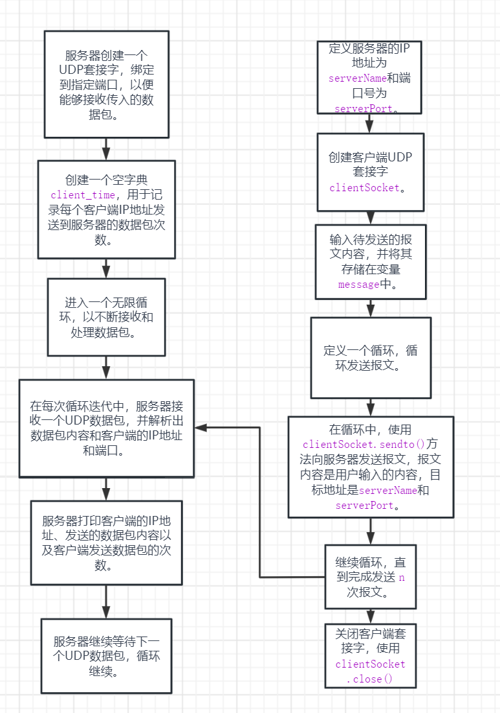
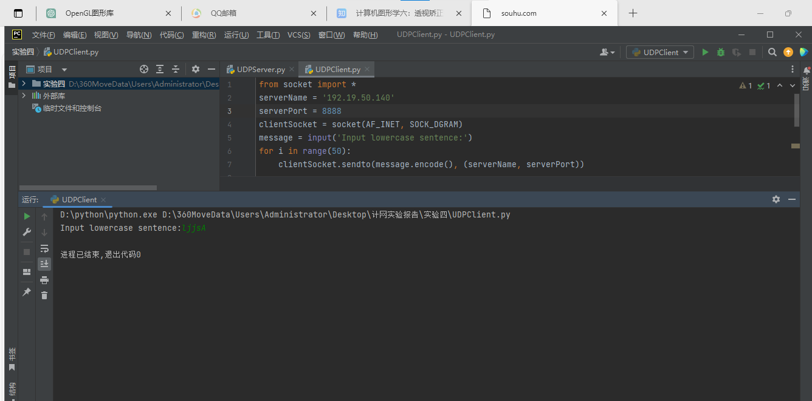
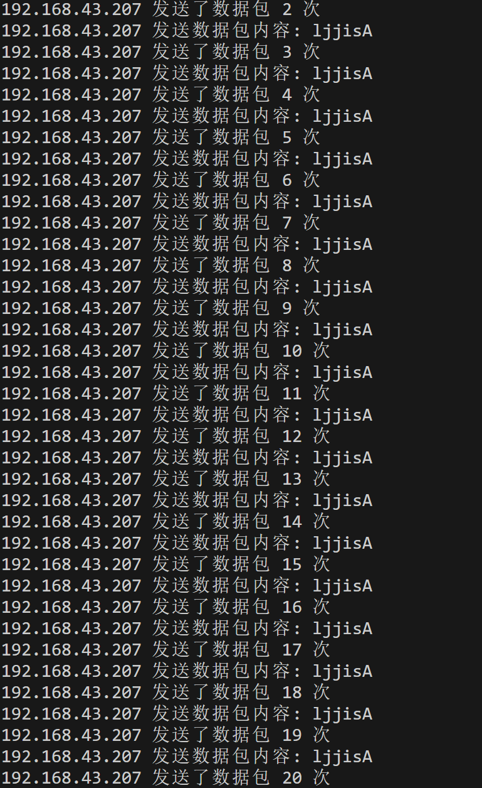
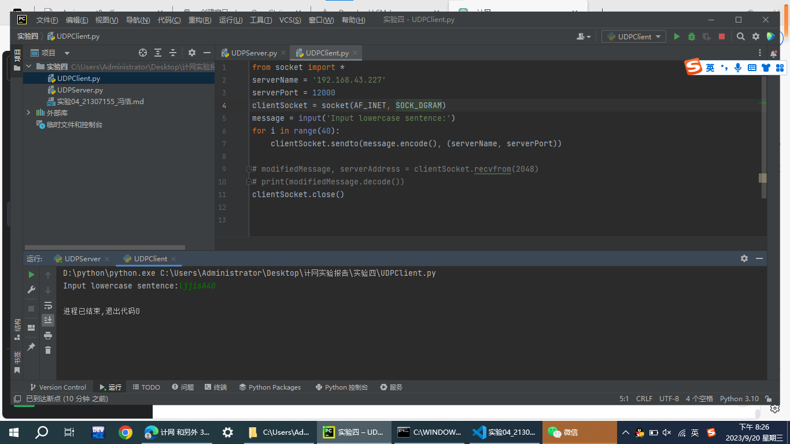
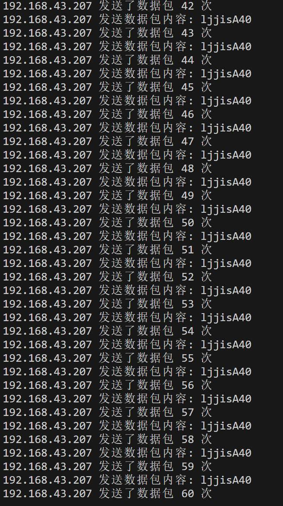
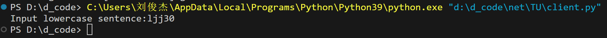
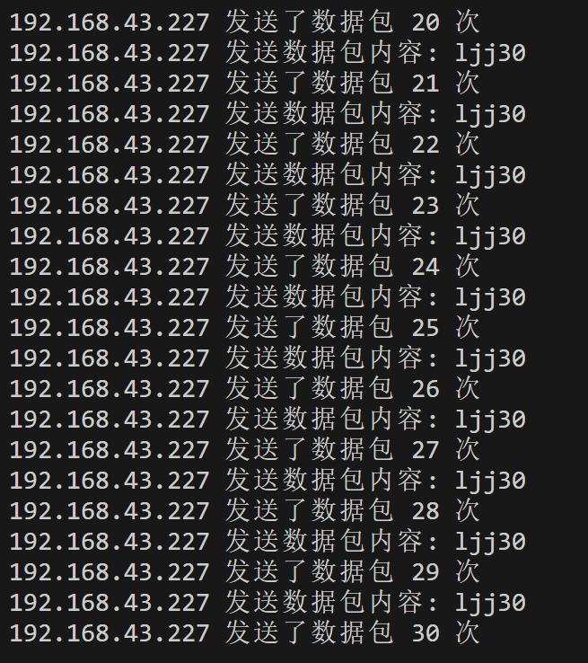
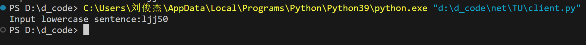
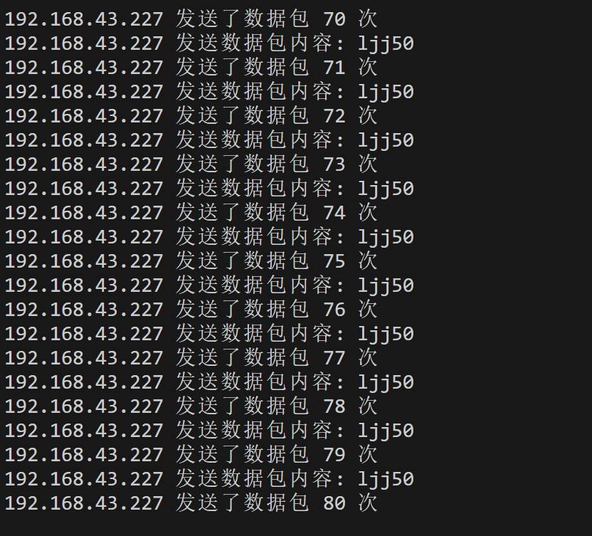

# 中山大学计算机学院计算机网络本科生实验报告

## 课程名称：计算机网络
 
教学班级|专业（方向）|学号|姓名
-|-|-|-
2班|计算机科学与技术|21307174|刘俊杰	


## 一、实验题目 
### 计算机网络 实验四
 
## 二、实验内容

### 1、UDP通信编程
#### 【目的】选择一个自己熟悉的操作系统和语言，编写采用UDP socket 的通信程序；
#### 【要求】编写服务器端和客户端程序。
客户端软件运行时，往服务器端（客户端IP地址+UDP端口为识别）发送用户输入的K个相同内容UDP数据包；
服务器端软件收到用户端的UDP数据后，每收到用户端（采用客户端IP地址+UDP端口为识别）的一个UDP数据包，服务器统计该用户发送的数据包个数并在本地屏幕上显示。
#### 【测试要求】
* 1）A机器运行服务器端软件；
* 2）在客户端B机器的命令行运行客户端软件2次，K值分别为20，40； 
* 3）在A机器也同时运行客户端软件2次，K值分别为30，50； 
* 4）退出服务器端软件。 
#### 【报告要求】 软件设计流程图、源代码、测试运行截图。
## 三、流程图

## 四、源代码
### 服务器端代码:
```python
#服务端
from socket import*
serverPort = 8888#端口号
serverSocket = socket(AF_INET,SOCK_DGRAM)#创建服务器套接字
serverSocket.bind(('',serverPort))#将端口号该服务器的套接字绑定在一起
client_time = {}#用字典记录每个ip向服务器发送报文的次数
print("The server is ready to receive")
while True:#循环接收并处理来自客户的分组
    message, clientAddress = serverSocket.recvfrom(2048)#接收客户分组
    
    #统计每个ip向服务器发送报文的次数
    if clientAddress[0] not in client_time:
        client_time[clientAddress[0]] = 1
    else:    
        client_time[clientAddress[0]] += 1
    
    #打印源地址发送的数据包内容和次数
    print(clientAddress[0],"发送数据包内容:",message.decode())
    print(clientAddress[0],"发送了数据包",client_time[clientAddress[0]],'次')
```
### 客户端代码:
```python
from socket import *
#客户端
serverName = '192.168.43.207'#服务器ip地址
serverPort = 8888#端口号
clientSocket = socket(AF_INET,SOCK_DGRAM)#创建客户套接字
message = input('Input sentence:')#输入报文内容
n=20
for i in range(n):#循环发送n次
    clientSocket.sendto(message.encode(),(serverName,serverPort))#发送报文
clientSocket.close()#关闭套接字
```
## 五、测试运行
首先两台机器都使用了校园网，但一直发送接受不了，经过老师提示，了解到校园网不允许两台机器的连通(但可以给本机发送，本机也可以接收到) ，故两台机器连接了个人热点(要注意防火墙可能会拦截UDP的连接)
A机器 IP 地址:192.168.43.227
B机器 IP 地址:192.168.43.207
端口号:8888
### 1）A机器运行服务器端软件；
### 2）在客户端B机器的命令行运行客户端软件2次，K值分别为20，40； 
B机器运行客户端，向A机器服务器发送20次ljjsA:

A机器收到数据包，且打印出数据包的内容和客户机发送数据包的次数:

B机器运行客户端，向A机器服务器发送40次ljjsA40:

A机器收到数据包，且打印出数据包的内容和客户机发送数据包的次数(可以看到这一次B客户端发送数据包40次加上上一次的20次等于60次):

### 3）在A机器也同时运行客户端软件2次，K值分别为30，50； 
A机器运行客户端，向A机器服务器发送30次ljj30:

A机器服务器收到了30次ljj30:

A机器运行客户端，向A机器服务器发送50次ljj50:

A机器运行客户端，向A机器服务器发送50次ljj50:

### 4）退出服务器端软件。 
